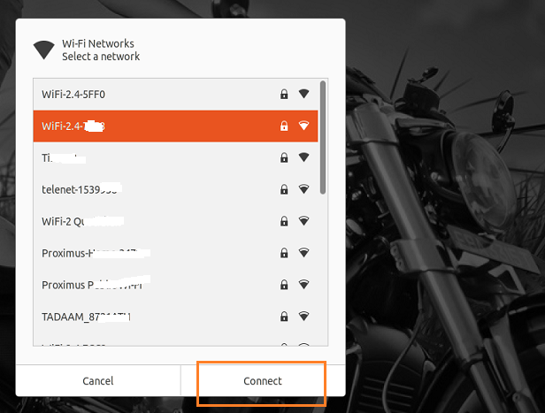

## Keterangan



Kondisi ini dipicu oleh perangkat lunak polkit yang pada dasarnya menyediakan kerangka otorisasi aplikasi. Polkit memantau tindakan yang dilakukan oleh pengguna dan memeriksa apakah pengguna berwenang atau tidak untuk melakukan tindakan tersebut pada sistem. Perangkat lunak Polkit bertugas untuk menerapkan beberapa aturan yang tersimpan didalam file konfigurasi policy yang nantinya akan menentukan apakah pengguna dapat melakukan suatu tindakan atau tidak.

## Langkah

- menerapkan sebuah kebijakan baru bagi polkit

## Prosedur

buat sebuah policy baru dengan perintah berikut

```shell
vi /etc/polkit-1/localauthority/50-local.d/47-allow-wifi-scan.pkla
```

atau

```shell
nano /etc/polkit-1/localauthority/50-local.d/47-allow-wifi-scan.pkla
```

lalu isikan konfigurasi dibawah keadalam file tersebut

```shell
[Allow Wifi Scan]
Identity=unix-user:*
Action=org.freedesktop.NetworkManager.wifi.scan;org.freedesktop.NetworkManager.enable-disable-wifi;org.freedesktop.NetworkManager.settings.modify.own;org.freedesktop.NetworkManager.settings.modify.system;org.freedesktop.NetworkManager.network-control
ResultAny=yes
ResultInactive=yes
ResultActive=yes
```

setelah itu simpan file dan ujicoba kembali dengan mengaktivkan module wifi dan mulai melakukan scaning jaringan yang tersedia. 
